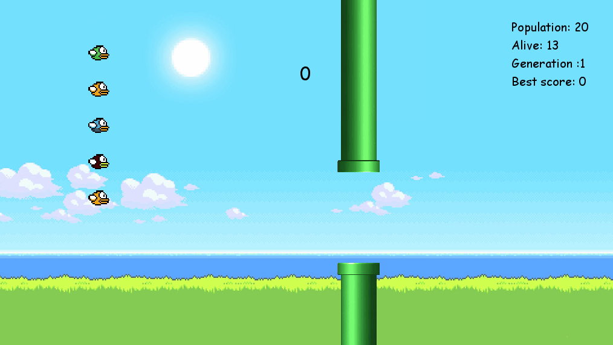

# Flappy bird Genetic algorithm implementation
Training a neural network with genetic algorithm to play flappy bird.

## Details of the genetic algorithm
- It starts with 20 birds (models).
- Each generation is based on the models that had the best fitness in the previous generation.   
- The mutation threshold is 2 %.

## First generations
At the beggining, models do some wrong things so most of them die quickly.

## Final Result
Later, they get better in each generation so finally we get a model that plays even better than a real person.

#### References
- https://www.askforgametask.com/tutorial/machine-learning-algorithm-flappy-bird/

*Eric Lozano*
