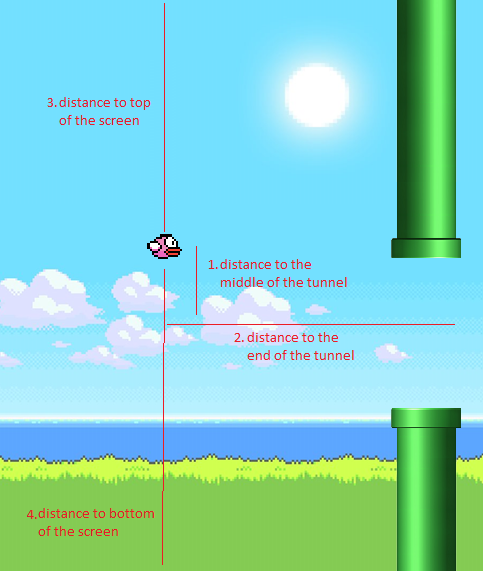

# Flappy bird Genetic algorithm implementation
Training a neural network with genetic algorithm to play flappy bird.

## Details of the genetic algorithm
- It starts with 20 birds (models).
- Each generation is based on the models that had the best fitness in the previous generation.   
- The mutation threshold is 2 %.

Every neural network has 4 inputs:
1. Distance to the middle of the tunnel.
2. Distance to the end of the tunnel.
3. Distance to the top of the screen.
4. Distance to the bottom of the screen.

## First generations
At the beggining, models do some wrong things so most of them die quickly.

## Final Result
Later, they get better in each generation so finally we get a model that plays even better than a real person.

#### References
- https://www.askforgametask.com/tutorial/machine-learning-algorithm-flappy-bird/

*Eric Lozano*
